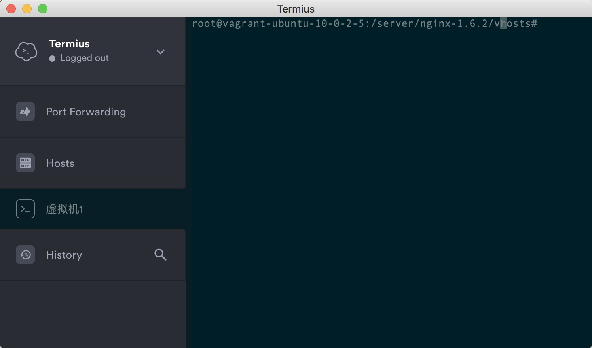

# Mac 下面使用 Termius 来管理 Linux 服务器

我自己本地的开发环境是 Virtualbox 搭建的 ubuntu 环境，有时候需要去服务器配置一个 Nginx 站点，这个时候需要去登录服务器。在 Windows 上面以前是用的 XShell 来管理的，在 Mac 下面找到一个 Termius 来管替代。 

## 下载 

这款软件拥有非常高的颜值，而且免费，还提供移动端版本，可以手机上登录服务器。

[下载地址](http://www.termius.com/)

## 颜值

看看吧，非常漂亮，可以修改终端的颜色。

